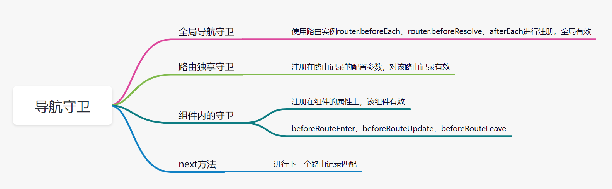

# 一、是什么？

使用者控制路由跳转逻辑时的钩子方法。通过`next`执行下一个路由的匹配逻辑。

根据位置不同分为：全局导航守卫、路由独享守卫、组件内部导航守卫



# 二、导航守卫注册

## 注册全局导航守卫

全局导航守卫：`beforeEach` `beforeResolve`'`afterEach`

```js
//源码位置 src/index,js
beforeEach(fn:Function):Function {
    return registerHook(this.beforeHooks,fn)
}
beforeResolve(fn:Function):Function {
    return registerHook(this.resolveHooks,fn)
}
afterEach(fn:Function):Function {
    return registerHook(this.afterHooks,fn)
}
```

注册全局导航守卫，通过`registerHook` 往钩子函数队列添加 fn，同时返回删除钩子函数的方法。

```js
function registerHook(list:Array<any>,fn:Function):Function 
{
    list.push(fn)
    return ()=>{
        let i= list.indexof(fn)
		 if(i>-1) list.splice(i,1)
     }
}

```

## 注册路由独享守卫

路由独享守卫是以路由配置的方式注册的

```js
const Route=[
    {
        name:'foo',
        component:Foo,
        beforeEnter:(to,from,next)=>{
            
        }
    }
]
```

## 注册组件内部守卫

注册组件内部守卫是以组件的属性进行注册的

```js
const compA={
    name:'compA',
    data(){
        return {
            
        }
    },
    beforeRouteEnter(to,from,next){
      //不能获取this
      //组件实例还没有创建
    },
    beforeRouteUpdate(to,from,next){
       //当路由改变，但组件被复用时
        // 如/foo/1 和 /foo/2  当渲染的是同一个组件，就是组件就被复用了
		// 可以获取this		        
    },
    beforeRouteLeave(to,from,next){
        // 导航离开该组件被调用
        // 可以访问this
    }
}
```

# 三、解析机制

```ts
//在路由改变时被  handleRoutingEvent（）调用
//执行按顺序路由守卫方法
function transitionTo() {
    const { updated, deactivated, activated } = resolveQueue(
      this.current.matched,
      route.matched
    )
  
//按解析顺序放入队列中
const queue:Array<?NavigationGuard> = [].concat(
2 extractLeaveGuards(deactivated)
3 this.router.beforeHooks,
4 extractUpdateHooks(updated),
5 activated.map(m=>m.beforeEnter)
6 resolveAsyncComponents(activated)
)

//尝试执行和做tryCatch处理
iterator(){}

runQueue(queue,iterator,()=>{
   //7，8
    const enterGuards=extractEnterGuards(activated)
    const queue = enterGuards.concat(this.router.resolveHooks)
	runQueue(queue,iterator , ()=>{
        9 确认  onComplete(route)
        ///10 afterEach在哪执行？
         if (this.router.app) {
          this.router.app.$nextTick(() => {
          11 更新视图  handleRouteEntered(route)
          })
        }

    })
    })   
}  

```

```js
//runQueue 执行queue所有的守卫解析函数
function runQueue(queue,fn,cb){
    const step = (idnex )=>{
        if(idnex >= queue.length) {
            cb()
        }else {
            if(queue[index]){
                fn(queue[index],()=>{
                    step(index+1)
                })
            }else {
                //没有的占着位置，没有的跳过
                step(index+1)
            }
        }
    }
    return step(0)
}
```


提取组件离开前守卫

```js
function extractLeaveGuards(deactived:Array<RouteRecord>):Array<?Function> {
    return extractGuards(deactivated,'beforeRouteLeave',bindGuard,true)
}
```

提取组件进入前守卫

```js
function extractEnterGuards (activated: Array<RouteRecord>): Array<?Function> {
 return extractGuards( activated,'beforeRouteEnter',
    (guard, _, match, key) => {
      return bindEnterGuard(guard, match, key)
    }
  )
}
```

extractGuard方法 ：提取某一类型导航守卫的所有钩子函数

```ts
function extractGuards (
  records: Array<RouteRecord>,
  name: string, // 'beforeRouteEnter'
  bind: Function,  //包裹钩子函数的执行
  reverse?: boolean
): Array<?Function> {
  const guards = flatMapComponents(records, (def, instance, match, key) => {
    const guard = extractGuard(def, name)
    if (guard) {
      return Array.isArray(guard)
        ? guard.map(guard => bind(guard, instance, match, key))
        : bind(guard, instance, match, key)
    }
  })
  //离开守卫的执行按照后入先出
  return flatten(reverse ? guards.reverse() : guards)
}
```

```js
//返回数组： 
【
【某一条记录：【compA的某一类型导航守卫】，【compB的某一类型导航守卫】】
【某一条记录：【foo的某一类型导航守卫】，【bar的某一类型导航守卫】】
】
export function flatMapComponents (
  matched: Array<RouteRecord>,
  fn: Function
): Array<?Function> {
  //返回数组  【【compA的某一类型导航首位】，【compA的某一类型导航首位】】
  return flatten(matched.map(m => {
    return Object.keys(m.components).map(key => fn(
      m.components[key],
      m.instances[key],
      m, key
    ))
  }))
}
```


完整解析流程

2 5 7 组件钩子   

 3 8 10 全局钩子  

1 【4】 6异步  

11DOM 12【7的回调】


1.导航被触发

2.在失活的组件里调离开守卫`beforeRouteLeave`

3.全局`beforeEach`

4.重用组件`beforeRouteUpdate`

5.路由配置`beforeEnter`

6.解析异步路由组件

7.**被激活**的组件 `beforeRouteEnter`

8.调用全局`beforeResolve`

9.导航被确认

10.调用全局`afterEach`

11。触发dom更新

12.`beforeRouteEnter`传给`next`的回调函数

